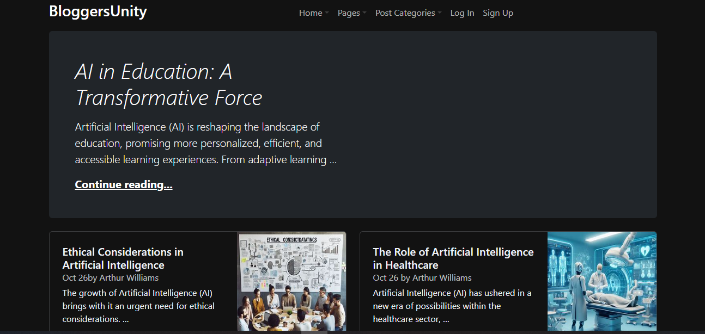
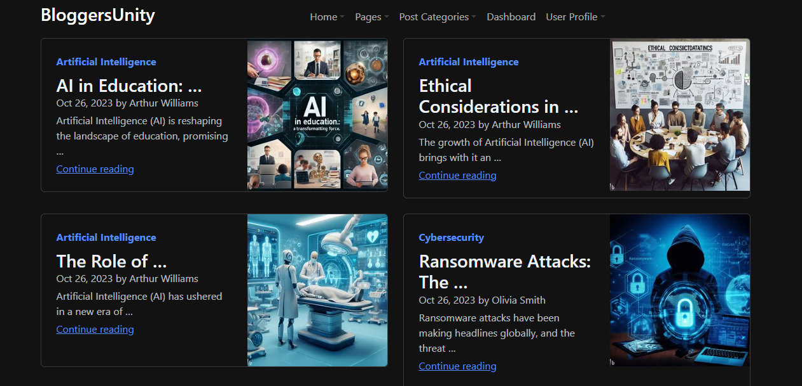
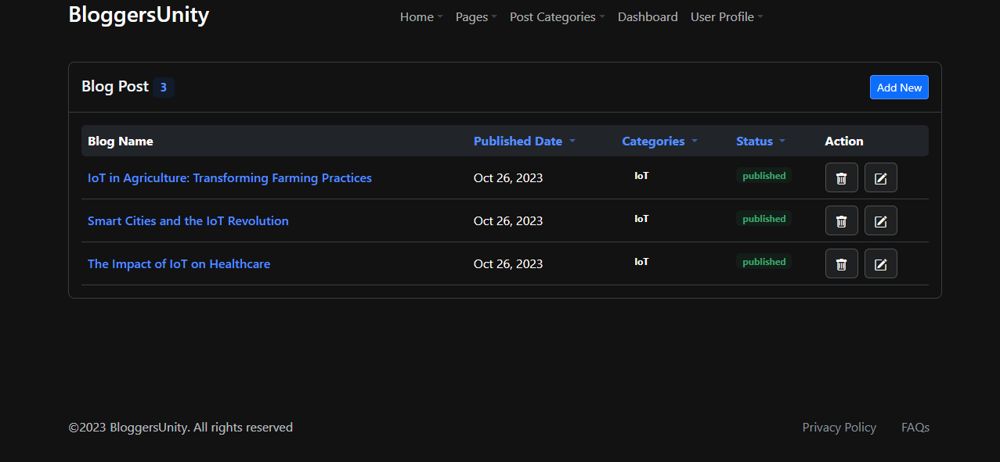

# BloggersUnity

[](LICENSE)

## Overview

BloggersUnity is a web application that allows users to create and publish blog posts. It's built with [Django](https://www.djangoproject.com/) 
and offers features like user authentication, creating, editing, and deleting posts.

## Features

- User authentication (signup, login, and logout)
- Create and publish blog posts
- Edit and delete your own posts
- View and browse posts by category
- User profile with avatar and contact information
- ...


## Getting Started

These instructions will help you set up a local development environment.

1. **Prerequisites**

   - Python 3.x
   - ...

2. **Installation**

   ```bash
   pip install -r requirements.txt
   cd BloggersUnity
   python manage.py migrate
   python manage.py runserver

3. **Usage**

Visit http://localhost:8000 to access the application.
Create an account and start writing your blog posts.

4. **Contributing**

Contributions are welcome! Please read CONTRIBUTING.md for details on our code of conduct and the process for submitting pull requests.

5. **License**

This project is licensed under the MIT License - see the LICENSE file for details.

6. **Documentation**

For detailed documentation, see the BloggersUnity Documentation.

7. **Authors**

Prakash Satvi


8. **Screenshots**
Home


Blog Post


Dashboard

