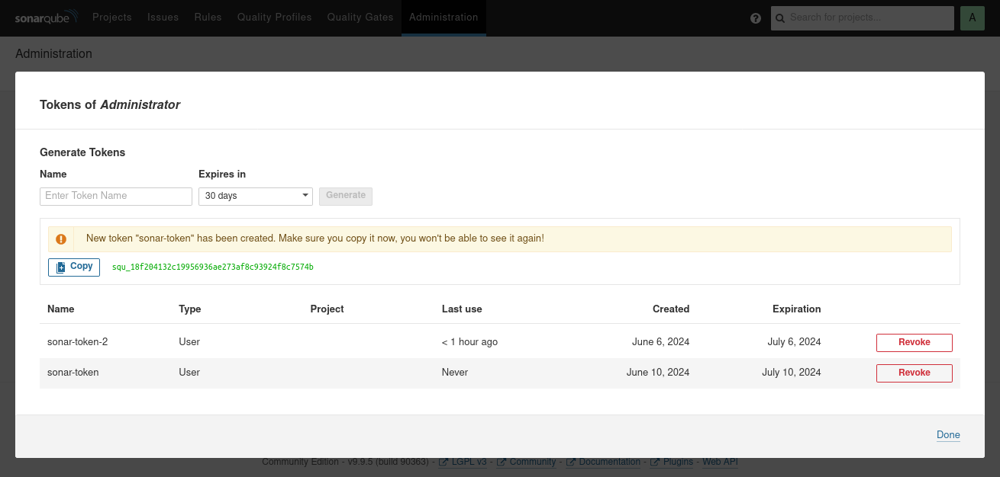
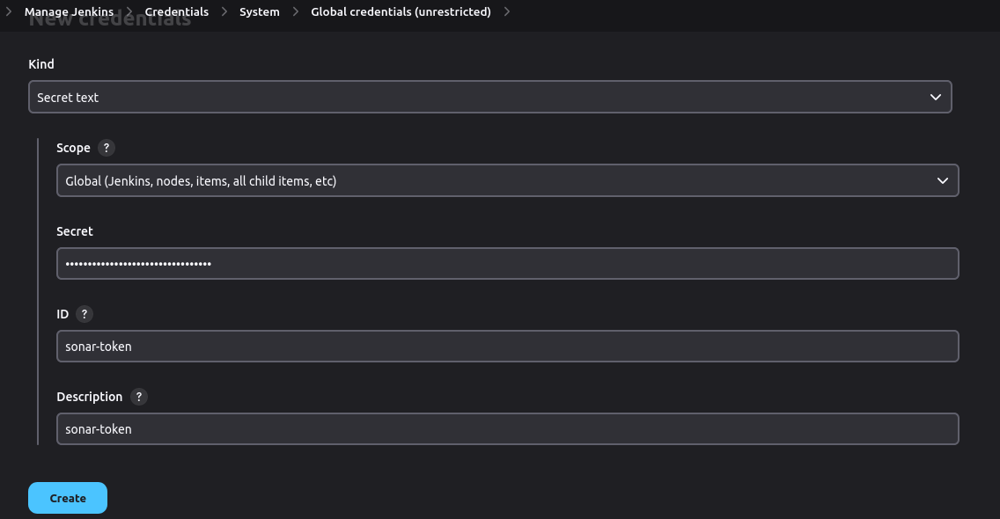
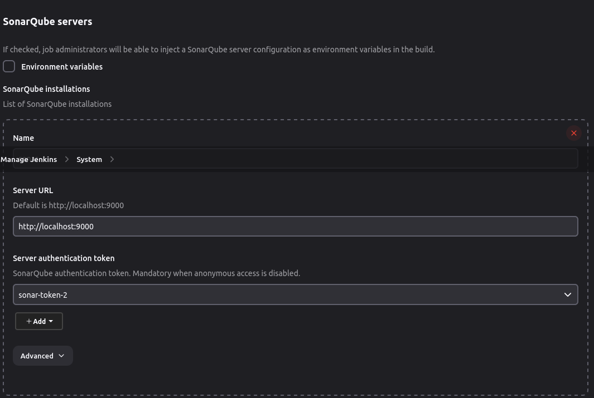
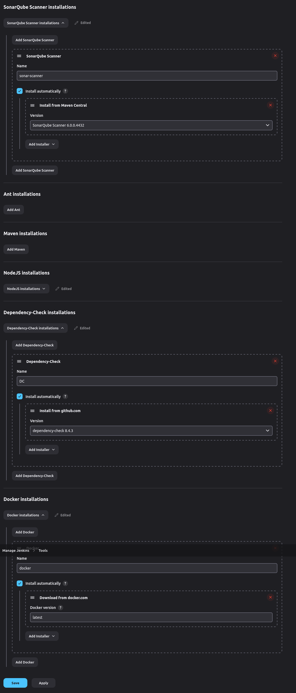
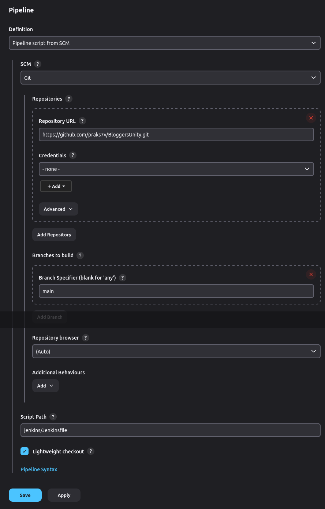

# Create Jenkins Pipeline

## Overview
This project uses Jenkins Pipeline to automate the build, test, and deployment processes. The Jenkins Pipeline is defined in a `Jenkinsfile` located at the `jenkins` directory of the repository.

- Follow the Jenkins official documentation for [Jenkins Installation](https://www.jenkins.io/doc/book/installing/).
  
## Prerequisites
- Jenkins installed and running
- Jenkins Pipeline plugin installed
- Appropriate credentials and permissions set up in Jenkins
- Access to the necessary build tools and environments (e.g., Docker)

## Pipeline Structure
The pipeline consists of the following stages:
1. **Checkout**: Fetch the latest code from the repository.
2. **OWASP Scan**: Check the depencency.
3. **Trivy Scan**: Scan the application.
4. **SonarQube Analysis**: Analyse the code using sonarqube.
5. **Build**: Compile the source code and build the application.
6. **Test**: Run unit and integration tests to verify the application.
7. **Deploy**: Deploy the application to the staging/production environment.

## Getting Started
The `Jenkinsfile` contains the pipeline script.

### Setup Instructions
1. **Clone the Repository**:
    ```bash
    git clone [https://github.com/your-repo/project.git](https://github.com/praks7v/BloggersUnity.git)
    cd BloggersUnity
    ```

2. **Configure Jenkins**:
    - Open Jenkins and navigate to the "New Item" page.
    - Create a new Pipeline job and configure it to use the `Jenkinsfile` from the repository.
      
   **Plugins to install**:
  - docker plugins
  - OWASP Dependency-Check Plugin
  - Pipeline
  - SonarQube Scanner for Jenkins

    **SonarQube Installation**

  To pull sonarqube docker iamge, use the following command:
   ```
   docker pull sonarqube:lts-community
   ```
  To run sonarqube docker iamge, use the following command:
   ```
   docker run -d --name sonarqube -p 9000:9000 sonarqube:lts-community
   ```
  To access the sonarqube on browser `http://localhost:9000/`.
  
  To login default username and password is `admin`.

  after go to the `http://localhost:9000/admin/users` create a token for jenkins credentials.
   
  
  Add Credentials for SonarQube at global scope (add as a secret text):
   
  
  Configure system for SonarQube:
    
   
  **Configure tools**:
  1. Sonarqube
  2. OWASP Dependency Check
  3. Docker
     
   
  
  
3. **Run the Pipeline**:
    - Trigger the pipeline manually or configure it to run automatically based on certain triggers (e.g., commit to the repository).



## Environment Variables
Make sure to configure any necessary environment variables in Jenkins for your build and deployment processes.

## Troubleshooting
- Ensure all paths and commands in the `Jenkinsfile` and `Makefile` are correct.
- Verify Jenkins has the necessary permissions to access the repository and execute the pipeline stages.
- Check the Jenkins logs for detailed error messages if the pipeline fails.

## Contributions
Feel free to submit pull requests or open issues if you encounter any problems or have suggestions for improvements.

## License
This project is licensed under the MIT License.
